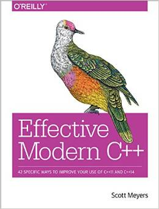

Effective Modern C++
====================

42 SPECIFIC WAYS TO IMPROVE YOUR USE OF C++11 AND C++14

Effective Modern C++ 中文翻译，欢迎大家提出翻译中的错误和用词不当的地方。



##代码使用说明

使用gitbook作为静态编译输出，需要安装`Node.js`，然后从`npm`安装gitbook

```sh
npm install gitbook -g
```

然后git clone下来本书，然后输出静态网页，在浏览器上查看：

```sh
git clone git@github.com:XimingCheng/Effective-Modern-Cpp-Zh.git
cd Effective-Modern-Cpp-Zh
gitbook serve .
```

gitbook会默认在端口`4000`开启服务器，使用浏览器访问[http://localhost:4000/](http://localhost:4000/)就可以访问然后阅读本书的中文翻译。随后我会将本书编译生成的静态网页上传至github pages。